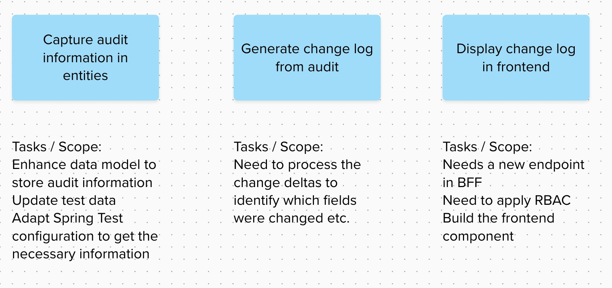

# Motivation

This series of posts is in response to **#IsAgileDead**. I therorize that agile isn't dead, but in the rush to transform, people have lost track of its foundations & orign. I am trying to correct that by sharing my learnings. I do not claim that I know everything or what I say will solve all the problems, but my hope is that by sharing my tools, I make it easier for others to adopt and tailor the processes. This post looks at breaking down stories so that the scope could be estimated and negotiated.

# The why

"Make your work visible" or "break down stories/features into chunks of work" or "we should negotiate on scope". Some variation of this advice is given to teams struggling with estimations. This is a good advice, but often hard to grasp. What does it mean?

I think the disconnect stems from people seeing estimates are seen as a number that has to be accepted, rejected or negotiated. It is much more than that! Good estimate should:

- Make assumptions & dependencies visible: What is needed for our prediction to have a higher probability of coming true?
- Facilitate conversations that bring us closer as a working unit or to our goals, not budget and finances.
- Make work/scope visible: If something has to be negotiated, it must be the scope. Ideally not cross functional requirements or tests!

Teams who struggle with this concept often find themselves compounding the problem. They may show too little breakdown, making negotiations hard. Or they may show too much, which may lead to meandering discussions & inputs which may be received as "micro-management".

Lost? Too vague? Let us take a look at a hypothetical example:

# A theoretical exercise

Let's try to estimate the following feature:

```text
As a superuser
I want to see the change history of X
So that I can troubleshoot when users complain about the data

Acceptance Criteria:

History should show
- Who made the change
- When
- On which field
- Old value and New Value

Solution needs to be a shareable library so that other teams could use this audit mechanism out of the box.

Cross Functional Requirements:
- Performance
- Consistency
- Principle of Least Privilege
```

Let's break it down!

## Step 1: Slice it

Break down the feature in chunks of work.

When I break down feature, I try to break them into units that are:

Incrementally bringing value. Stories should be still complete and bring us forward, but not depend on other work to be valuable. This provides the business to pivot without having a lot of sunk cost
Independently testable & deployable. I think it goes hand in hand with the first point, but may be more tangible.

Maybe a picture helps:



Slicing them like this gives the benefit that we can stop playing the feature at any story and still get the benefit, as long as the story is finished, the feature can be resumed in the future.

## Step 2: Verify that you covered everything

Hopefully someone in your team points out that we forgot to plan an acceptance criteria! We need to make our audit framework reusable by other teams.

>)

## Step 3: Identify dependencies and information gaps

Right now, we have a dependency and a knowledge gap in Story titled “Create a shared library for other teams to use”. We need to get a buy in from other teams or the architects. Does the other team use the same persistence framework? Do they use NoSQL by any chance? Do they store images or other blobs? 
This is the moment to stop. We cannot estimate till we have some indication or some assumptions we can make. Try to get people who can answer this for you in to the meeting. Prepare a list of questions that you want to ask them.

## Step 4: Estimate!

Here is where people will bring in uncertainties & hesitate to put a number. We don't know how we will capture the information! We don't know what will work, we don't know what impact will it have on our test configurations. So many unknowns!

This is the hard part. We need to be comfortable in not knowing everything! It is important to remember the following:

> Estimates can never replace conversations, they can only facilitate them.

Now we come to a state where we have to deal with uncertainty. There are many ways it can be tackled, I will list two possibilities:

- Create a spike to identify the unknowns
- Make reasonable assumptions and factor them in.

No one way is better than the other, it really is a judgement call. Personally, I prefer to avoid spikes unless really needed.

So, lets proceed with an assumption: This is a common enough usecase that Spring ecosystem would have solved it. But we also know that tinkering with configurations in spring and finding the optimal solution is a pain in the butt. Let us add it to the scope & factor it in our estimates.

And now, remember the story points post. We are not estimating them with person days, but comparing them to something we did in the past. Find the closest match and move on.

## Step 5: Negotiate

I have never seen a dev team come up with a number that matches the ones PMs have in their head. Odds are, PMs are going to freak out at the number you came up with. They are likely complaining that this is too costly and takes way too long!

Show them the breakdown of the work. Have a conversation about the scope. See what can be cut. Propose something if you can. Perhaps the cost of creating a shared library is too high and can be shifted to the future. Or accepted as a cost of rework, maybe it is cheaper for other teams to reference your solution and create theirs. Maybe there are some risks that need to be owned. The possibilities are endless, but won't be realized if one doesn't have the conversation.

# Conclusion

Estimates, negotiations & discussions are necessary. To make them useful & less painful needs a mindset change.

> We need to change the question on our mind from “Why is this so costly?” to “What can I cut out safely?”

Hope that helps make your plannings, estimations & scope negotiations a bit less painful!
